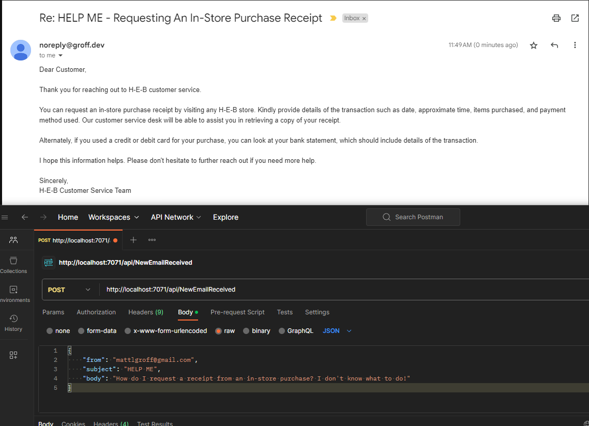

# AI Customer Service Agent (Email-based) Azure Function Example - Node.js



This Node-based Azure Functions sample demonstrates how to take an e-mail from a customer and use OpenAI's GPT to generate a response. The response is then sent to the customer via e-mail (Sendgrid).

## Why is it using the ChatCompletion API if it's not a Chat?
The ChatCompletion API let's you utilize OpenAI's Function Calling feature. Their GPT models have been trained to accurately call functions with set arguments including content and type. GPT is very good at orchestrating well-documented processes and this is a great example of that. Having the "sendEmail" function be well-defined with a subject and body argument allows GPT to generate a response that is "almost" guaranteed to be a valid e-mail. Things can still go wrong to be clear, but are much less likely when you have a well-defined function.

## Complications
Notice in the function definition for "sendEmail" I had to define twice about using newline `/n` characters instead of having a string of text on multiple lines. This is because it was generating invalid JSON for the "text" argument. It seems to be resolved now that it is super explicit about using newline characters but it's something to watch out for.

## Next steps to make this a real product
* Setup an Office 365 email in-box to receive e-mails from customers. 
* Setup an Azure Logic App to trigger the Azure Function when an e-mail is received.
* Query the Office 365 in-box for `get_email_history` to get the last 10 e-mails from the customer. This will further improve the quality of the responses.
* Setup a Vector Database to store and query Frequently Asked Questions. This will further improve the quality of the responses.

## Pre-requisites
* Node 18.15.0 (Node 18.16+ has issues running Azure Functions locally in development)
* Sendgrid API Key
* OpenAI API Key

```bash
npm install
npm start
```

Create a `local.settings.json` (think of this like an `.env` it must be private) using the `.example.local.settings.json` for a template:
```json
{
  "IsEncrypted": false,
  "Values": {
    "AzureWebJobsStorage": "",
    "FUNCTIONS_WORKER_RUNTIME": "node",
    "SENDGRID_API_KEY": "",
    "SENDGRID_FROM_EMAIL": "noreply@groff.dev",
    "SYSTEM_PROMPT": "You are a Customer Service Representative for H-E-B, a company based in San Antonio, Texas. Since 1905, H-E-B has been proudly serving Texans. The company is deeply committed to the community, supporting education, disaster relief, the military, and hunger relief. Sustainability is a key focus for H-E-B. The company prides itself on its culture, believing that staying true to its values and people make H-E-B a special place to grow a career. You can only communicate through email. Never say you are an AI Assistant. Your emails should be helpful, short, and friendly.",
    "OPENAI_API_KEY": "",
    "OPENAI_MODEL": "gpt-4",
    "OPENAI_MODEL_TEMPERATURE": "0"
  }
}
```

## Deployment
See the Github Action's `.github/workflows/main_newemailreceived.yml` provided by Azure's publish profile. The only thing I changed was the NODE_VERSION to 18.15 to match the local development environment.

## Example POST Request
```bash
curl -X POST \
  http://localhost:7071/api/NewEmailReceived \
  -H 'Content-Type: application/json' \
  -d '{
    "from": "customer@gmail.com",
    "subject": "HELP ME",
    "body": "How do I request a receipt from an in-store purchase? I don'\''t know what to do!"
}'
```

